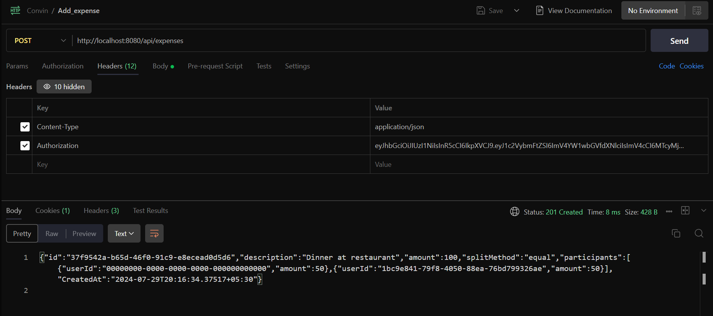
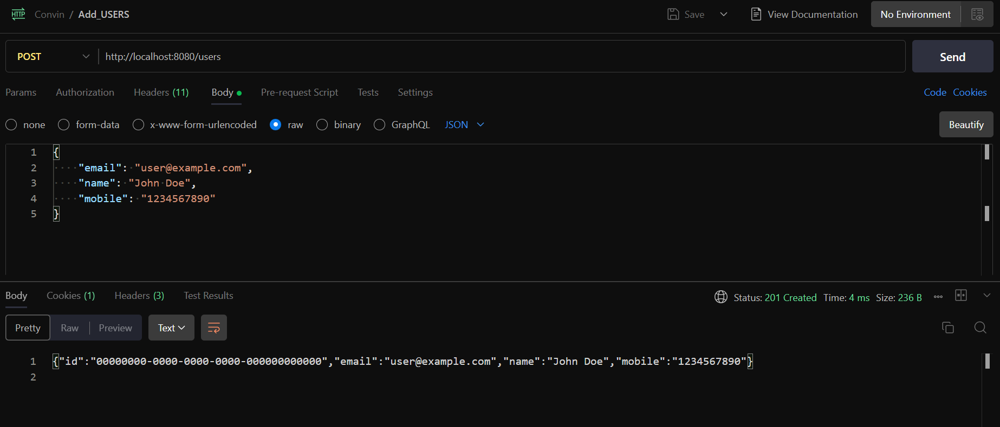
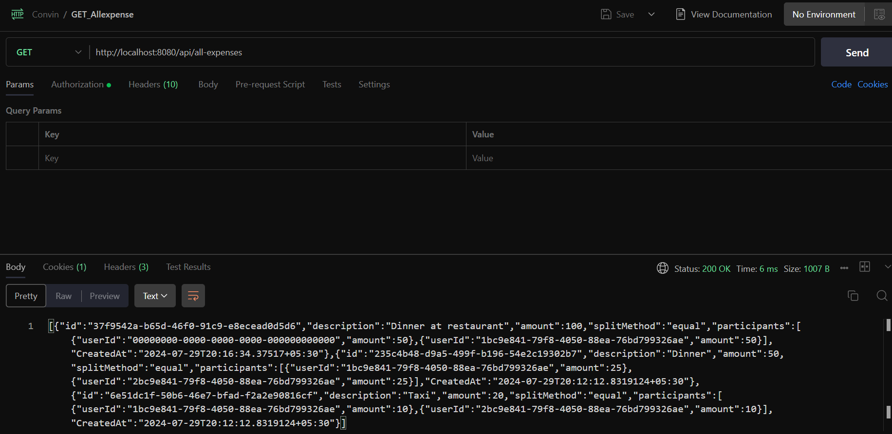
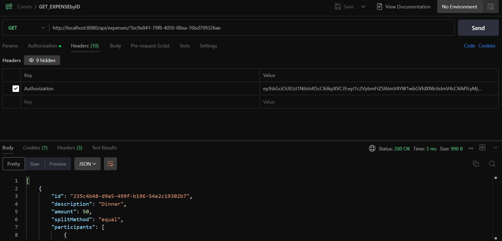
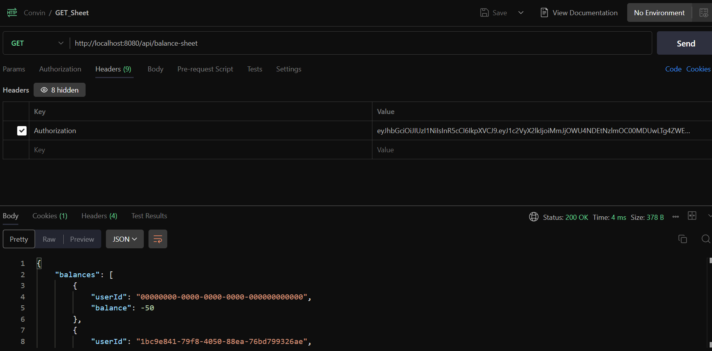
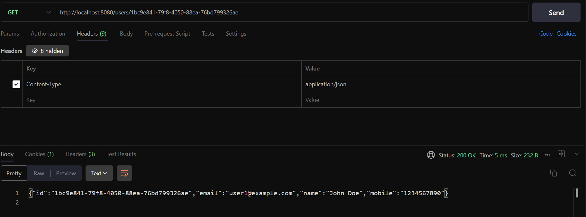
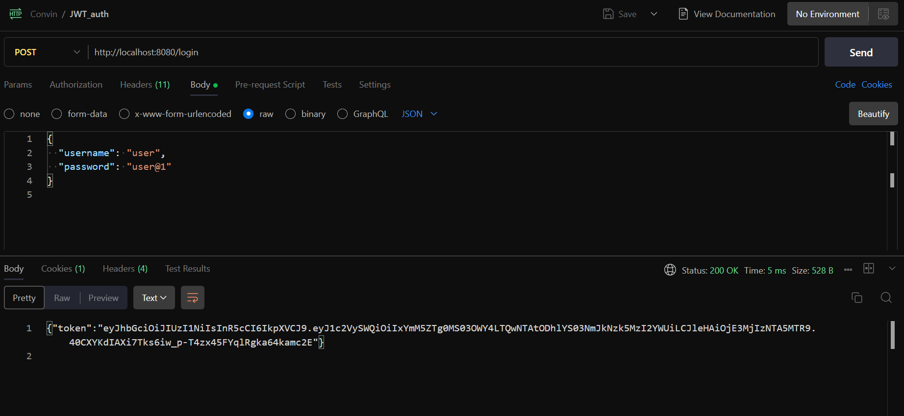

# Daily Expenses API

## Overview

- The Daily Expenses API is a web application designed to manage and track daily expenses. It allows users to register, log in, and manage their expenses. The API also supports generating balance sheets to summarize the financial status of users.

**Features**

- User registration and login
- JWT-based authentication
- Adding expenses
- Fetching user-specific expenses
- Fetching all expenses
- Downloading balance sheets

**Technologies Used**

- Go
- Gorilla Mux
- JWT (JSON Web Tokens)
- UUID for unique identification

## Project Structure

The project is organized into several packages:

```
D:.
├───api
├───auth
├───cmd
│   └───server
├───internal
│   ├───database
│   ├───expense
│   ├───middleware
│   └───user
├───New folder
└───pkg
    ├───middleware
    └───utils
    
```

- api : Contains route registration and request handlers.
- auth : Manages JWT authentication and middleware.
- cmd : Contains the main entry point for the application.
- internal : Contains the core logic for users and expenses.
- database: Manages in-memory storage.
- expense: Contains models, handlers, and services for expense management.
- user: Contains models, handlers, and services for user management.

Installation

1. Clone the repository:

git clone https://github.com/Aadik1ng/Convin-AI.git 
cd daily − expenses

2. Install dependencies: go mod tidy
2. Run the server:

```
go run cmd/server/main. go

API Endpoints

User Routes

- POST /login : Log in a user and receive a JWT token.

Request body :

{

”username ”: ”string ” , ”password ”: ”string”

}

- POST /users : Create a new user.

Request body :

{

”email ”: ”string ” , ”name”: ”string ” , ”phone”: ”string”

}

- GET /users/ {id}: Fetch a user by ID.

Expense Routes (Requires JWT Authentication)

- POST /api/expenses : Add a new expense.

Request body :

{

”description ”: ”string ” , ”amount”: ” float ” , ”splitMethod ”: ”string ” , ”participants ”: [

{

”userId ”: ”uuid” ,

”amount”: ” float ” ,

”percentage ”: ” float ” }

]

}

- GET /api/expenses/ {userId }: Fetch expenses for a specific user.
- GET /api/all-expenses : Fetch all expenses.
- GET /api/balance-sheet : Download the balance sheet.

```

### Authentication

The API uses JWT for authentication. Upon successful login, a token is issued which must be included in the Authorization header of subsequent requests:

```Authorization : Bearer <token >```

Sample Data Initialization

The application initializes with sample data for testing purposes. The sample data includes predefined users and expenses to facilitate quick testing and development.

## Middleware

### Authentication Middleware

The AuthMiddleware validates the JWT token in the Authorization header, extracts the user ID from the token, and adds it to the request context.

## Example Usage

1. Register a User:

curl −X POST http :// localhost :8080/ users −d ’{”email ”:” john . doe@example .com” ,  ”name"}

2. Login:

curl −X POST http :// localhost :8080/ login −d ’{”username”:” user ” ,  ”password ”:”user@1"}

3. Add an Expense:

curl −X POST http :// localhost :8080/ api/expenses −H ”Authorization :  Bearer  < token>

4. Fetch User Expenses:

curl −X GET http :// localhost :8080/ api/expenses/1bc9e841 − 79f8− 4050− 88ea− 76bd79932

5. Download Balance Sheet:

curl −X GET http :// localhost :8080/ api/balance − sheet −H ”Authorization :  Bearer  < token>


## Output Screenshots:-

- ADD_EXPENSE 

- ADD_USERS 

- GET_ALLexpense 

- GET_EXPENSEbyID 

- GET_SHEET 

- GET_USER

- JWT_AUTH 


## Author

-  ***Aaditya Aaryan*** 